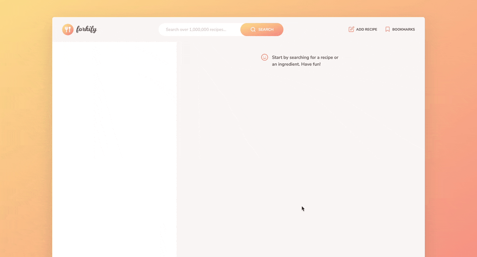
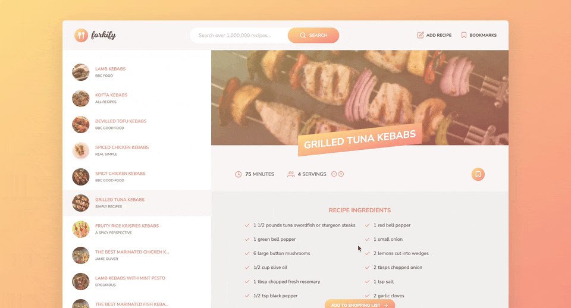
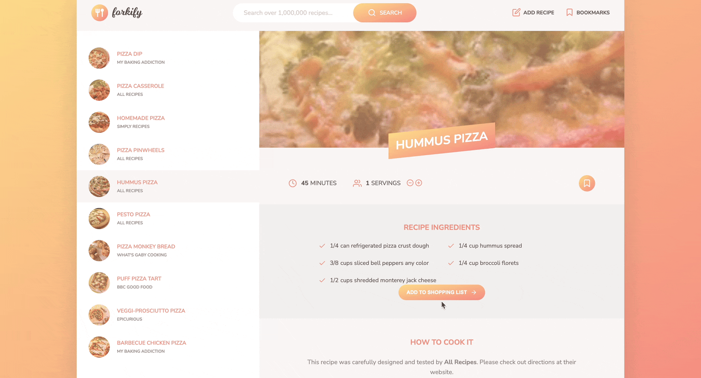
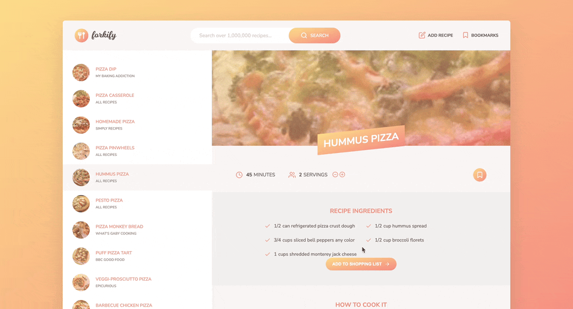

# Forkify: Your Culinary Adventure Starts Here 🍕

🍽️ Welcome to Forkify, your ultimate recipe destination! Here, you can easily find the dishes you crave, learn how to whip them up, and get the scoop on the ingredients you'll need. Customize recipes to fit your needs, whether you're cooking for one or hosting a feast. Save your favorite dishes for later and even share your own culinary creations with our community. Forkify is your food-loving friend, here to make your cooking journey delicious and fun. Join us and let's cook up some magic together! 👨‍🍳🍕

## Attribution

This project is based on the **Forkify project** from **The Complete JavaScript Course by Jonas Schmedtmann**.

The original project concept, design, and structure are not my own. However, I personally implemented the project while following the course and wrote the code myself rather than copying an existing GitHub repository.

Throughout the development process, I studied and implemented the concepts covered in the course, including JavaScript, APIs, MVC architecture, asynchronous programming, and DOM manipulation. I also made my own adjustments and changes while building and debugging the project.

This repository is published for **learning and portfolio purposes** and is not presented as an original project or design.

## Table of Contents

- [Features](#🍳-Forkify-Recipe-Web-App-Features)
- [Screenshots](#Screenshots)
- [Installation](#Reproducing-the-Project)
- [Usage](#usage)

## 🍳 Forkify Recipe Web App Features:

- Extensive Recipe Search: Explore over 1,000,000 recipes effortlessly.

- Powered by Forkify API: Access a vast database of culinary inspiration.

- Ingredient Details: Discover the ingredients needed for each dish.

- Customizable Serving Size: Adjust recipes for your desired number of servings.

- Detailed Instructions: Link to the source site for step-by-step recipe procedures.

- Favorite Recipe Bookmarking: Users can bookmark their favorite recipes to access them later with ease.

- Local Storage: Data is preserved even after exiting the app, ensuring your preferences are saved.

## Screenshots

01 - Search for Recipes: Find Your Favorites with Ingredient or Name


02 - Manage Your Favorites: Bookmark or Unbookmark Recipes Effortlessly


03 - Adjust Serving Sizes: Customize Recipes to Your Needs


04 - Share Your Creations: Add Your Own Special Recipes


## Reproducing the Project

To reproduce this project on your local machine, follow these steps:

```bash
git clone https://github.com/Benyamin-mirzajavadi/forkify.git

npm install

npm start
```

## Usage

Get started with Forkify and make the most of its features:

1. #### Search for Recipes:

- Start on the homepage by entering a keyword or ingredient in the search bar.
- Click the search button to access a variety of recipes.

2. #### Discover Recipe Details:

- Browse through the search results to find a recipe that piques your interest.
- Click on a recipe to explore its detailed information, including ingredients and step-by-step instructions.

3. #### Save Your Favorites:

- To save a recipe for future reference, click the "Save Recipe" button.
- Access your saved recipes conveniently from the "Favorites" section.

4. #### Enjoy Your Culinary Journey:

- Explore, organize, and savor your favorite recipes with ease using Forkify.
